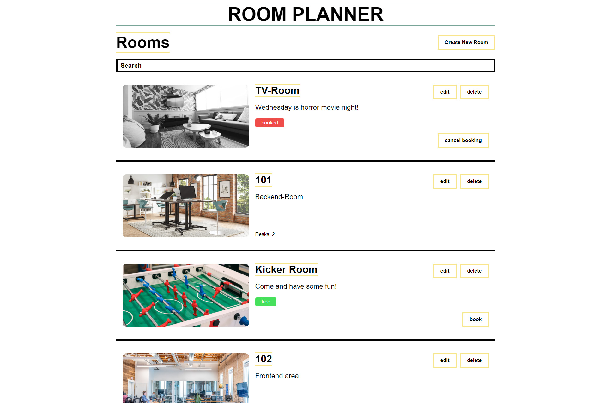

# frontend-challenge

Welcome to our frontend challenge! We have built a small backend for a tool, where users can book rooms and desks inside a coworking space. The idea is the following:

If you plan to go to the office, you can book a table or a room. An office building consists of two types of rooms:

- A room with bookable desks inside, like a typical working room
- A room without work desks, like a TV room or a conference room

You can never book a room if it has bookable desks inside, only the desks inside the room are bookable. On the other hand, a room without desks can be booked.

The backend development is already done. Your job is to start with the frontend development of the first two features: The list of rooms and booking a room. This means as well, that creating/editing tables and rooms, booking tables and a room detail view is out of scope for this challenge.

## Before we get started:

- Take as much time as you need to finish the excercise
- If anything is unclear, don't hesitate to ask the person who has sent you the challenge for help
- Try to follow the tasks and implement the design as closely as possible
- Create a branch for your solution and make a PR containing everything you have done when you finished the challenge
- Put reasonable information inside the PRs description, as you would do it in an enterprise context

## Things you might need:

- A working machine with Linux, Windows or MacOS
- Node 14 or above
- An IDE
- Docker
- Docker Compose
- This repo for instructions and the backend's docker compose file

## Tools, frameworks and libraries you should use:

- TypeScript
- Next.js
- Apollo Client

# Getting the Backend up and running

Copy the `docker-compose.yml` into your repo and run `docker-compose up` or `docker compose up` inside it. A docker container with a PostgreSQL Database and another container with the backend should spin up.

You can reach the backend via `http://localhost:4000/graphql`. If you open this URL inside your browser, you should see the GraphQL Playground with a documentation of all queries and mutations.

Default data will automatically be seeded on backend startup. If you need to reset the data, just run the mutation `resetDB`.

# Tasks

In this view, the users can see a filterable list of rooms as well as a button to create a room. Inside the room elements, users can book rooms which have no desks and edit or delete rooms.

## Header

- Create a headline for the whole app ("Room Planner")
- Create a smaller Headline for the room list page ("Rooms")
- Add an input for filtering the room list by name of the room

## Room List

- Create a room element which can be used inside the list
- Add the room's image which is greyed out if the room is booked
- Add a hover effect for the whole list element in a color of your choice
- Add the room's name, description and booking status
- If the room has desks, put the number below the description
- Add an edit and delete button
- If the edit button is clicked, nothing should happen for now
- If the delete button is clicked, the room should be deleted
- If the room has no desks, put a "book" button below the two buttons
- If the book button is clicked, the room should be booked and the button should change its title to "unbook"
- If the "unbook" button is clicked, the room should be unbooked and the button should change its title back to "book"

## That's it!

Have fun and don't forget to send us the link to your solution's repo when you are done!
